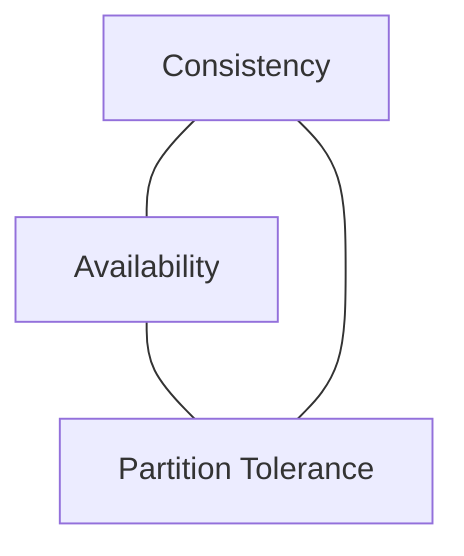
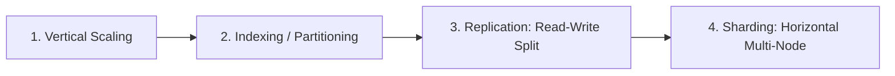
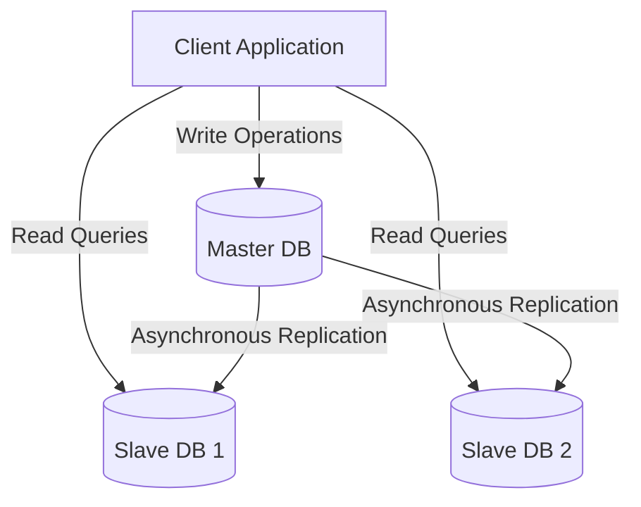

# System Design for Beginners: Everything You Need in One Article

*Based on the foundational system design guide by Shivam Bhadani*

---

## Table of Contents
1. [Why Study System Design?](#1-why-study-system-design)
2. [What is a Server?](#2-what-is-a-server)
3. [Latency and Throughput](#3-latency-and-throughput)
4. [Scaling (Vertical, Horizontal, Auto Scaling)](#4-scaling)
5. [Back-of-the-envelope Estimation](#5-back-of-the-envelope-estimation)
6. [CAP Theorem](#6-cap-theorem)
7. [Database Scaling (Indexing, Partitioning, Master-Slave, Sharding)](#7-database-scaling)
8. [SQL vs. NoSQL Databases](#8-sql-vs-nosql-databases)
9. [Blob Storage](#9-blob-storage)
10. [Monolith vs. Microservices](#10-monolith-vs-microservices)

---

## 1. Why Study System Design?

In software engineering, writing code that works on a local computer is only the first step. When an application transitions from a prototype with a few users to a global platform serving millions or billions of concurrent requests, simple architectures quickly fail.

### Core Objectives of System Design
*   **Scalability:** Structuring the system so it can handle increasing loads (users, traffic, data volume) by adding resources without degrading performance.
*   **Reliability & Fault Tolerance:** Designing the system so that it continues to function correctly even when individual components (hardware, networks, databases) fail.
*   **Availability:** Ensuring that the system remains accessible and responsive to user requests (minimizing downtime).
*   **Cost-Efficiency:** Achieving performance targets while optimizing hardware, bandwidth, and operations spending.
*   **Trade-off Management:** System design is the art of making compromises. You cannot optimize for everything simultaneously; you must choose between consistency and speed, read-heavy or write-heavy configurations, and complexity or maintainability based on business requirements.

### Career Significance
For software engineers, system design is a key benchmark for senior-level capability. It transitions your focus from *how to write a specific function* to *how to architect a reliable ecosystem of interconnected components*.

---

## 2. What is a Server?

A **server** is a physical computer or software process that provides resources, services, or data to other computers, known as **clients**, over a network.

### Client-Server Architecture
In a client-server model, communication is request-driven:
1.  **Client Request:** A browser, mobile app, or IoT device initiates a request (e.g., HTTP `GET /profile`).
2.  **Network Transmission:** The request travels over the internet using protocols like TCP/IP.
3.  **Server Processing:** The server parses the request, executes business logic (often retrieving or modifying data in a database), and prepares a response.
4.  **Client Response:** The server returns the requested resources (HTML, JSON, media) back to the client.

```
+------------+                  Network                  +------------+
|            |  ---------- Request (HTTP/gRPC) --------> |            |
|   Client   |                                           |   Server   |
| (Frontend) |  <--------- Response (JSON/HTML) -------- |  (Backend) |
+------------+                                           +------------+
```

### Physical vs. Virtual Servers
*   **Bare Metal (Physical) Servers:** Dedicated hardware machines with CPUs, RAM, and storage disks. They offer high performance but lack flexibility and require manual maintenance.
*   **Virtual Machines (VMs):** Software-emulated servers running on top of a physical host via a hypervisor. This allows multiple isolated OS environments on a single physical machine.
*   **Containerized Instances (e.g., Docker, Kubernetes):** Lightweight, isolated runtimes that share the host OS kernel, allowing rapid scaling and high resource utilization.

---

## 3. Latency and Throughput

Latency and Throughput are the primary metrics used to measure system performance and responsiveness under load.

### Latency (The Cost of Time)
*   **Definition:** The time elapsed between a client sending a request and receiving the corresponding response. It is a measure of system delay.
*   **Measurement Unit:** Milliseconds (ms) or microseconds (µs).
*   **Influencing Factors:** Network travel time (speed of light in fiber), hardware processing time, database query optimization, and geographical distance.

### Throughput (The Capacity to Handle Load)
*   **Definition:** The volume of work or requests that a system can successfully process within a given unit of time. It is a measure of system capacity.
*   **Measurement Unit:** Queries Per Second (QPS), Transactions Per Second (TPS), or Read/Write Operations Per Second.

### The Highway Analogy
Imagine a highway system:
*   **Latency:** The time it takes for a single car to travel from Point A to Point B.
*   **Throughput:** The number of cars passing a specific toll booth or mile marker every hour.

```
       <-- Latency: Travel time of 1 car (e.g., 20 mins) -->
[Point A] ===================== Highway ===================== [Point B]
          ====> (Car 1)  ====> (Car 2)  ====> (Car 3)
       <-- Throughput: Number of cars passing per hour (e.g., 500 cars/hr) -->
```

### The System Trade-off
While they are distinct concepts, latency and throughput are mathematically related. If you batch multiple operations together:
*   **Throughput increases** (the server processes more requests per unit of time due to reduced overhead).
*   **Latency increases** (individual requests must wait for the batch to fill before being sent or processed).

---

## 4. Scaling

Scaling is the process of adjusting system resources to accommodate changing levels of application traffic and database storage.

### 1. Vertical Scaling (Scaling Up)
Vertical scaling means increasing the capacity of an existing single server by upgrading its hardware specifications.

*   **Action:** Upgrading a server from 8 Cores / 16 GB RAM to 64 Cores / 256 GB RAM.
*   **Pros:**
    *   **Simple Implementation:** No architectural changes are required. The codebase remains exactly the same.
    *   **Zero Network Overhead:** Inter-process communication happens in memory, eliminating network latency issues.
*   **Cons:**
    *   **Hardware Ceiling:** There is a strict physical limit to how much RAM or CPU a single machine can hold.
    *   **Single Point of Failure (SPOF):** If the single high-spec server crashes, the entire system goes offline.
    *   **Cost Inefficiency:** High-end enterprise servers scale exponentially in cost compared to mid-range machines.

### 2. Horizontal Scaling (Scaling Out)
Horizontal scaling means adding more standard machines to your pool of resources and distributing workloads across them.

*   **Action:** Adding five identical 4-Core / 8 GB RAM servers behind a load balancer.
*   **Pros:**
    *   **Infinite Elasticity:** You can continuously add new servers as traffic grows.
    *   **High Availability & Redundancy:** If one server crashes, the remaining nodes absorb the load, avoiding downtime.
    *   **Cost-Efficient:** Commodity hardware is cheap and easy to replace.
*   **Cons:**
    *   **Architectural Complexity:** Requires a load balancer, stateless application design, and distributed data consistency strategies.
    *   **Network Overhead:** Components must communicate over the network, introducing latency.

```
       Vertical Scaling (Scale Up)                   Horizontal Scaling (Scale Out)
         +--------------------+                      +------+  +------+  +------+
         |                    |                      | Server|  | Server|  | Server|
         |    Giant Server    |                      +------+  +------+  +------+
         | (64 Cores, 256GB)  |                                 Load Balancer
         +--------------------+                                       |
                                                               Client Requests
```

### 3. Auto Scaling
Auto scaling is a cloud computing feature that dynamically adjusts the number of running server instances based on real-time traffic demand.

*   **Under-provisioning Risk:** Running too few servers causes CPU/memory exhaustion, leading to slow response times or crashes during traffic spikes.
*   **Over-provisioning Risk:** Running too many servers wastefully consumes cloud budget during low-traffic hours (e.g., middle of the night).
*   **How it Works:** 
    1.  **Metric Collection:** Cloud agents monitor CPU utilization, memory usage, or active connection counts.
    2.  **Trigger Rules:** Policies dictate scaling rules, for example: *"If average CPU usage exceeds 80% for 3 consecutive minutes, spin up 2 new instances."*
    3.  **Scale In:** Once traffic subsides and CPU usage falls below a threshold (e.g., 30%), instances are terminated to save costs.

---

## 5. Back-of-the-envelope Estimation

Back-of-the-envelope estimation is the practice of performing quick, high-level mathematical calculations to determine if a proposed system architecture is feasible. It helps size databases, bandwidth, and CPU capacity before writing a single line of code.

### Core Mathematical Constants
*   **Seconds in a Day:** $60 \text{ sec} \times 60 \text{ min} \times 24 \text{ hr} = 86,400$ seconds.
    *   *Interview Tip:* Round this to **100,000** to make mental math much faster and easier.
*   **Scientific Notation Reference:**
    *   Million ($10^6$): 1,000,000
    *   Billion ($10^9$): 1,000,000,000
    *   1 Kilobyte (KB) = $10^3$ bytes
    *   1 Megabyte (MB) = $10^6$ bytes
    *   1 Gigabyte (GB) = $10^9$ bytes
    *   1 Terabyte (TB) = $10^{12}$ bytes
    *   1 Petabyte (PB) = $10^{15}$ bytes

---

### Step-by-Step Calculation Examples

Assume we are designing a Twitter-like application with the following characteristics:
*   **Daily Active Users (DAU):** 100 Million
*   **Write Operations:** 10% of users tweet once per day.
*   **Read Operations:** Each user views their feed containing 20 tweets daily.
*   **Average Tweet Size:** 300 bytes of text and metadata.

#### A. Load Estimation (QPS)
First, calculate the average write queries per second:
$$\text{Daily Writes} = 100,000,000 \times 10\% = 10,000,000 \text{ tweets/day}$$

$$\text{Average Write QPS} = \frac{10,000,000 \text{ tweets}}{100,000 \text{ seconds}} = 100 \text{ QPS}$$

Next, calculate the average read queries per second:
$$\text{Daily Reads} = 100,000,000 \text{ users} \times 20 \text{ views/day} = 2,000,000,000 \text{ reads/day}$$

$$\text{Average Read QPS} = \frac{2,000,000,000 \text{ reads}}{100,000 \text{ seconds}} = 20,000 \text{ QPS}$$

*   **Peak QPS Estimation:** Apply a 3x multiplier to account for peak hours (e.g., breaking news events).
    $$\text{Peak Read QPS} = 20,000 \times 3 = 60,000 \text{ QPS}$$

---

#### B. Storage Estimation
Calculate how much storage we need daily and over a 5-year retention period.
$$\text{Daily Storage} = 10,000,000 \text{ tweets/day} \times 300 \text{ bytes/tweet} = 3,000,000,000 \text{ bytes} = 3 \text{ GB/day}$$

Over 5 years ($5 \times 365 \approx 1,825$ days):
$$\text{5-Year Storage} = 3 \text{ GB/day} \times 1,825 \text{ days} = 5,475 \text{ GB} \approx 5.48 \text{ TB}$$

*   **Replication Factor:** In production, data is replicated (e.g., 3x replication factor) to ensure durability.
    $$\text{Total Required Storage} = 5.48 \text{ TB} \times 3 = 16.44 \text{ TB}$$

---

#### C. Bandwidth Estimation
Calculate incoming and outgoing network bandwidth.
*   **Ingress (Incoming Bandwidth):** Data uploaded to our servers.
    $$\text{Ingress} = \text{Write QPS} \times \text{Tweet Size} = 100 \text{ QPS} \times 300 \text{ bytes} = 30,000 \text{ bytes/sec} = 30 \text{ KB/s}$$
*   **Egress (Outgoing Bandwidth):** Data downloaded by users reading their feeds.
    *   Each read request retrieves 20 tweets.
    $$\text{Payload per Read} = 20 \text{ tweets} \times 300 \text{ bytes/tweet} = 6,000 \text{ bytes (6 KB)}$$
    $$\text{Egress} = \text{Read QPS} \times \text{Payload per Read} = 20,000 \text{ QPS} \times 6 \text{ KB} = 120,000 \text{ KB/s} = 120 \text{ MB/s}$$

---

## 6. CAP Theorem

The CAP Theorem (Brewer's Theorem) states that a distributed system can deliver at most two out of the following three guarantees at the same time:



### The Three Guarantees
1.  **Consistency (C):** Every read operation receives the most recent write or an error. In other words, all nodes see the exact same data at the same time.
2.  **Availability (A):** Every non-failing node returns a non-error response to every request (without guaranteeing that it contains the most recent write).
3.  **Partition Tolerance (P):** The system continues to operate despite network partitions (dropped packets, slow networks, or communication failures between servers).

### The Inevitable Trade-off
In a distributed network, network partitions (P) are an unavoidable reality. Physical fiber cables can be cut, and routers can fail. Therefore, when a network partition occurs, you must choose between:
*   **Consistency (CP Systems):** To guarantee consistency, the system must reject or block write/read operations on nodes that are cut off from the rest of the cluster, sacrificing Availability.
    *   *Examples:* MongoDB, Redis, HBase.
*   **Availability (AP Systems):** To guarantee availability, nodes continue accepting reads and writes even if they cannot communicate with each other. This results in temporarily inconsistent data across nodes, sacrificing Consistency.
    *   *Examples:* Apache Cassandra, CouchDB, DynamoDB.

---

## 7. Database Scaling

When a database becomes a performance bottleneck, scaling it requires a structured approach.



### 1. Indexing
*   **Concept:** A data structure (usually a B-Tree or LSM-Tree) created on one or more database columns to accelerate query searches.
*   **Analogy:** The index at the back of a textbook. Instead of reading every page (a "full table scan"), you look up the page number and jump directly to it.
*   **Trade-off:** Faster reads (`SELECT` statements) at the expense of slower writes (`INSERT`, `UPDATE`, `DELETE`), because the database must update the index structure every time data changes.

### 2. Partitioning
*   **Concept:** Dividing a single large database table into smaller, distinct parts called partitions, while still hosting them on the **same physical server**.
*   **Vertical Partitioning:** Splitting columns (e.g., storing user login credentials in one partition, and large profile bio text in another).
*   **Horizontal Partitioning:** Splitting rows (e.g., partitioning a transaction table by year, so 2025 transactions are stored separately from 2026 transactions).
*   **Management:** Handled automatically by the Database Management System (DBMS).

### 3. Master-Slave (Leader-Follower) Replication
Designed for read-heavy systems to distribute query loads and protect against data loss.

*   **Master Node:** Handles all write operations (`INSERT`, `UPDATE`, `DELETE`). It acts as the single source of truth.
*   **Slave Nodes:** Receive data updates asynchronously from the Master node and handle all read operations (`SELECT`).
*   **Pros:**
    *   Significantly scales read performance by adding more slave nodes.
    *   Provides backup; if the master dies, a slave can be promoted to master.
*   **Cons:**
    *   **Replication Lag:** Slaves sync asynchronously, meaning reads might briefly return stale data.
    *   Does not scale write capacity (all writes still go through the single Master node).



### 4. Sharding (Horizontal Scaling across Servers)
*   **Concept:** Breaking a large database table into rows and distributing them across **multiple independent physical database servers** (shards).
*   **Routing:** Managed at the **application level**. Your backend code must decide which database server holds the requested data using a **Sharding Key**.
*   **Sharding Key Strategies:**
    *   *Hash-based:* `Server ID = Hash(user_id) % Number of Shards`.
    *   *Range-based:* Shard 1 holds users A-M, Shard 2 holds users N-Z.
*   **Challenges:** 
    *   Joining tables across different shards is extremely slow and complex.
    *   **Hot Shards:** If one partition is accessed far more frequently than others (e.g., a celebrity's account on Shard 1), it can overload that specific server.

---

## 8. SQL vs. NoSQL Databases

Selecting the correct database type is a fundamental architectural decision.

| Feature | Relational (SQL) Databases | Non-Relational (NoSQL) Databases |
| :--- | :--- | :--- |
| **Data Model** | Structured tables with fixed schemas (Rows and Columns). | Flexible schemas (Key-Value, Document, Columnar, Graph). |
| **Scaling** | Primarily Vertical (scaling hardware on a single server). | Horizontal (native support for sharding across multiple nodes). |
| **Consistency** | Strong consistency (ACID compliant: Atomicity, Consistency, Isolation, Durability). | Eventual consistency (BASE compliant: Basically Available, Soft state, Eventual consistency). |
| **Relationships** | Highly optimized for complex table joins. | Unstructured; joins are avoided or handled at application level. |
| **Examples** | PostgreSQL, MySQL, SQLite, Microsoft SQL Server. | MongoDB (Document), Redis (Key-Value), Cassandra (Columnar). |

### Decision Guide
*   **Choose SQL when:** You need high data integrity, complex relational queries, and ACID compliance (e.g., financial transactions, billing software, inventory tracking).
*   **Choose NoSQL when:** You are handling massive volumes of unstructured or semi-structured data, require high-speed write speeds, and need simple horizontal scaling (e.g., social media feeds, real-time chats, user sessions, shopping carts).

---

## 9. Blob Storage

A **Blob** (Binary Large Object) is a collection of unstructured binary data stored as a single entity. 

### Why Database Tables are Bad for Large Files
Storing large files (like images or videos) inside database rows (using data types like `BLOB` or `BYTEA`) degrades query performance. It inflates database backup times, wastes RAM caches on unstructured bytes, and increases database maintenance costs.

### The Blob Storage Architecture
Instead of storing files directly in the database:
1.  **File Upload:** The application backend uploads the raw file (e.g., profile picture) to a dedicated Blob Storage service.
2.  **Unique URL:** The Blob Storage service returns a static URL pointing to the file (e.g., `https://my-bucket.s3.amazonaws.com/user_45_avatar.png`).
3.  **Database Storage:** The database only stores this lightweight string URL inside the user's profile table.

```
                  +-----------------------------------+
                  |        Client Browser             |
                  +-----------------------------------+
                       /                         \
         1. Upload File                           3. Request Avatar URL
                     /                             \
                    v                               v
         +--------------------+             +------------------+
         |    Blob Storage    |             |  Relational DB   |
         |     (AWS S3)       |             |  (PostgreSQL)    |
         +--------------------+             +------------------+
         | avatar_file.png    |             | user_id | url    |
         +--------------------+             +------------------+
         | Returns static URL | ----------> | 45      | s3_url |
         +--------------------+             +------------------+
```

### Popular Blob Services
*   Amazon Web Services (AWS) S3
*   Google Cloud Storage (GCS)
*   Azure Blob Storage

---

## 10. Monolith vs. Microservices

Architectural patterns dictate how application codebase and deployment structures are organized.

```
       Monolithic Architecture                   Microservices Architecture
     +---------------------------+             +--------+  +--------+  +--------+
     |   Single Unified App      |             | User   |  | Order  |  | Payment|
     | (Users, Orders, Payments) |             | Service|  | Service|  | Service|
     +---------------------------+             +--------+  +--------+  +--------+
                   |                               |           |           |
             Single Database                 DB 1 (Users)  DB 2 (Orders) DB 3 (Payments)
```

### 1. Monolithic Architecture
In a monolith, the entire application is built as a single, unified codebase and deployed as a single unit.

*   **Pros:**
    *   **Simple Development:** Easy to set up, test, debug, and run locally.
    *   **Low Operational Complexity:** Only one deployment pipeline and server environment to manage.
    *   **Shared Memory:** Fast communication between functions without network overhead.
*   **Cons:**
    *   **Scale Bottleneck:** You cannot scale individual features. If the payment module is heavy, you must duplicate the entire application on new servers.
    *   **Coupled Codebase:** A bug or memory leak in one minor feature can crash the entire application.
    *   **Deployment Blockers:** Even a tiny copy change requires recompiling and redeploying the entire system.

### 2. Microservices Architecture
In a microservices architecture, a large application is decomposed into small, independent services that focus on specific business capabilities. Each service runs in its own process, communicates via lightweight APIs (REST, gRPC, message queues), and manages its own database.

*   **Pros:**
    *   **Independent Scalability:** You can scale only the services under heavy load (e.g., scale up the checkout service during Black Friday while keeping the catalog service quiet).
    *   **Fault Isolation:** If the recommendation service crashes, users can still check out and pay.
    *   **Technology Agnostic:** Teams can write the Payment service in Go, the Auth service in Node.js, and the ML service in Python.
*   **Cons:**
    *   **Operational Complexity:** Requires service discovery, complex CI/CD pipelines, container orchestration (Kubernetes), and decentralized monitoring.
    *   **Data Consistency:** Maintaining data integrity across separate databases requires distributed transaction patterns (like the Saga Pattern).
    *   **Network Overhead:** Microservices must communicate over networks, introducing latency and potential security risks.

### Transition Strategy: The Strangler Fig Pattern
Moving from a Monolith to Microservices should never be done in a single "big bang" rewrite. Instead, use the **Strangler Fig Pattern**:
1.  Place an API Gateway or reverse proxy in front of the Monolith.
2.  Build a new microservice for one specific feature (e.g., User Profiles).
3.  Route profile requests from the gateway to the new microservice instead of the monolith.
4.  Repeat this process for other modules until the monolith is completely replaced (strangled).
